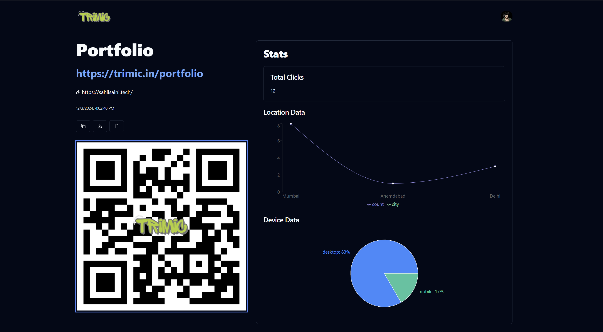
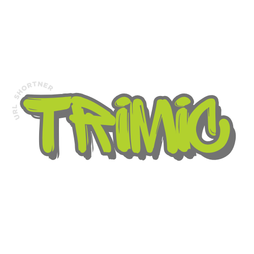

# Trimic

Trim your URL with powerful analytics! 🚀

## About Trimic

Designed to help you trim your long URLs into short, manageable links while providing comprehensive analytics to track their performance. Whether you're a marketer, developer, or just someone who wants to share cleaner links, Trimic has got you covered.

  

<!--  -->

